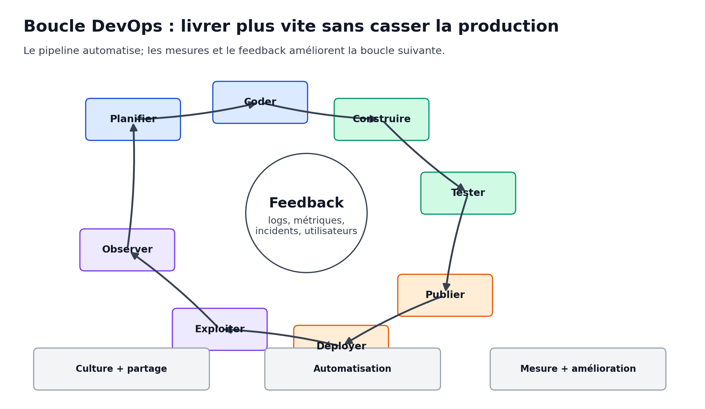
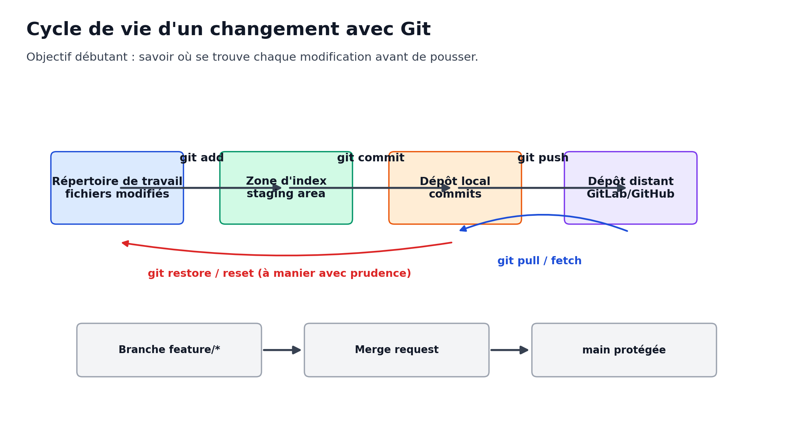
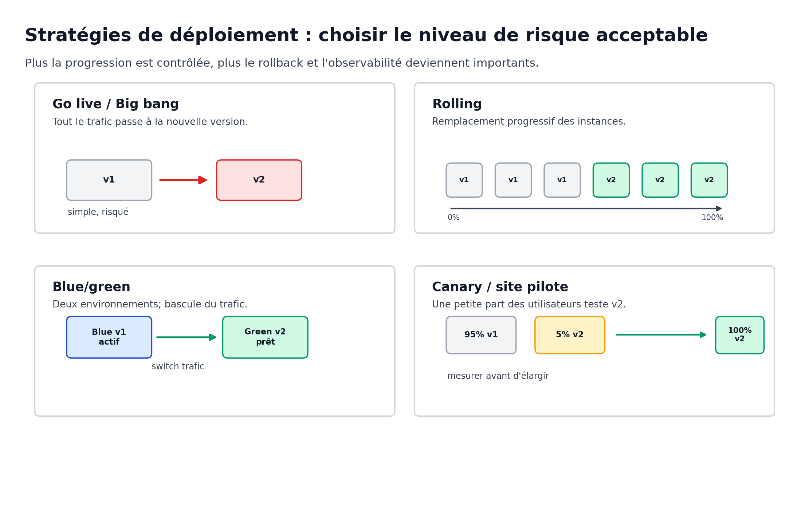
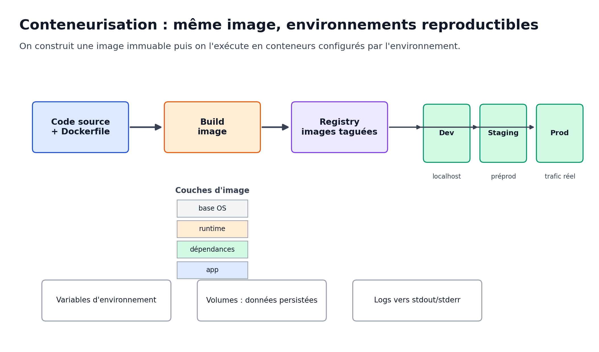
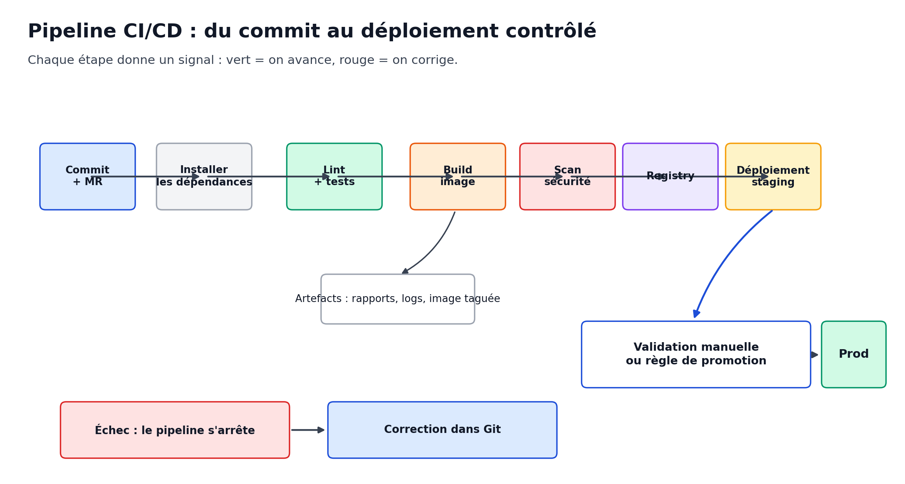

**Public cible :** développeurs en 3e année d'études supérieures, avec accompagnement prévu pour les apprenants n'ayant jamais pratiqué Git.

**Durée indicative :** 5 jours, alternance théorie / pratique / projet fil rouge.

**Livrables pédagogiques :** support de cours, exercices guidés, TP fil rouge, checklist de déploiement, grille d'évaluation formative.

_Schémas originaux créés pour ce support. Les références [S...] sont détaillées en fin de document._

# 1. Positionnement du cours

Ce support répond au besoin du module **INF83 - Déploiement continu DevOps** : amener les apprenants à déployer une application de façon automatisée dans une démarche DevOps, en couvrant la gestion de versions, les valeurs et pratiques DevOps, la conteneurisation et l'installation/configuration d'une solution d'intégration continue [S0].

Il est volontairement progressif : un étudiant qui n'a jamais utilisé Git doit pouvoir suivre les premières manipulations, puis comprendre comment Git devient le point de départ d'un pipeline CI/CD complet.

## 1.1 Objectifs pédagogiques opérationnels

À la fin des 5 jours, un apprenant doit être capable de :

| Objectif | Résultat observable |
|---|---|
| Mettre en place un logiciel de versionning | Créer un dépôt Git, committer proprement, travailler en branche, résoudre un conflit simple, synchroniser avec un dépôt distant. |
| Documenter les évolutions | Rédiger des messages de commit utiles, tenir un changelog, taguer des versions, distinguer correction, maintenance et évolution. |
| Expliquer DevOps | Définir les principes CALMS, les pratiques CI/CD, les environnements de déploiement et les métriques de pilotage. |
| Conteneuriser une application | Écrire un `Dockerfile`, construire une image, l'exécuter, paramétrer l'application avec des variables d'environnement, utiliser Docker Compose. |
| Automatiser la livraison | Configurer une pipeline GitLab CI ou Jenkins, exécuter tests/build, produire un artefact ou une image, déployer en staging puis préparer une promotion en production. |
| Diagnostiquer un incident de déploiement | Lire les logs, reproduire un bug, formuler une procédure d'escalade et proposer un rollback. |

## 1.2 Fil conducteur des 5 jours

| Jour | Fil conducteur | Pratique dominante |
|---|---|---|
| Jour 1 | Versionning, évolution applicative, Git pour débutants, introduction automatisation / conteneurs. | Exercices Git individuels puis binômes. |
| Jours 2 et 3 | Culture DevOps, CALMS, CI/CD, environnements, stratégies de déploiement, pratiques de maintenance. | Cartographie d'un flux de livraison et conception de pipeline. |
| Jours 4 et 5 | Docker, Docker Compose, GitLab CI/Jenkins, TP de déploiement d'un projet existant. | TP fil rouge : conteneuriser, automatiser, déployer, documenter. |

> **Principe pédagogique.** On ne commence pas par « installer un outil ». On commence par le problème : comment livrer plus souvent, avec moins de stress, plus de traçabilité et moins d'écarts entre les environnements ?

## 1.3 Pré-requis et matériel recommandé

Chaque apprenant doit disposer de :

- un terminal utilisable ;
- un éditeur ou IDE ;
- Git installé et configuré ;
- Docker Desktop ou Docker Engine selon l'environnement de formation ;
- un accès à une forge Git, par exemple GitLab ou GitHub ;
- un accès à une solution CI : GitLab CI, Jenkins, ou instance fournie par l'intervenant ;
- un projet applicatif simple : API, application web, service Node.js, Spring Boot, Python, PHP, .NET, etc.

Commandes de vérification :

```bash
git --version
docker --version
docker compose version
```

# 2. Vue d'ensemble : de l'idée au déploiement

Un déploiement continu n'est pas seulement un script. C'est un système complet : des personnes, un dépôt Git, des règles de collaboration, un pipeline, des environnements, des contrôles qualité, des journaux et des procédures de retour arrière.



Le modèle DevOps vise à réduire la distance entre développement, exploitation et utilisateurs. Le cadre CALMS résume les dimensions à travailler : **Culture, Automation, Lean, Measurement, Sharing** [S7]. Les métriques DORA aident ensuite à objectiver la performance de livraison, par exemple le délai entre commit et production, la fréquence de déploiement ou le temps de récupération après échec [S8].

## 2.1 Les mots à maîtriser dès le début

| Terme | Définition courte | Exemple concret |
|---|---|---|
| Dépôt | Espace versionné contenant code, historique et configuration. | Un projet GitLab avec `README.md`, `src/`, `Dockerfile`. |
| Commit | Point d'historique décrivant un changement cohérent. | `fix(auth): reject expired token`. |
| Branche | Ligne de travail isolée. | `feature/checkout`, `fix/login-500`. |
| Merge request / Pull request | Demande de fusion avec discussion, revue, CI. | Fusionner une branche dans `main`. |
| Pipeline | Suite automatisée d'étapes. | Installer, tester, construire, scanner, déployer. |
| Artefact | Résultat produit par le pipeline. | Rapport de tests, paquet `.jar`, image Docker. |
| Image Docker | Modèle immuable d'exécution. | `registry.example.com/app:1.2.0`. |
| Conteneur | Processus isolé lancé à partir d'une image. | Un service API démarré par `docker run`. |
| Registry | Entrepôt d'images. | Docker Hub, GitLab Container Registry. |
| Environnement | Cible de déploiement avec configuration propre. | `dev`, `test`, `staging`, `prod`. |
| Secret | Donnée sensible injectée sans être commitée. | Mot de passe DB, token API. |

## 2.2 Intégration continue, livraison continue, déploiement continu

| Pratique | Idée | Question de contrôle |
|---|---|---|
| CI - Continuous Integration | Intégrer fréquemment les changements et exécuter des contrôles automatiques. | « Mon code est-il intégrable sans casser le projet ? » |
| Continuous Delivery | Le logiciel est toujours dans un état livrable ; la mise en production reste décidée par un humain. | « Peut-on livrer maintenant si le métier valide ? » |
| Continuous Deployment | Chaque changement validé par la pipeline peut être déployé automatiquement en production. | « Le pipeline peut-il aller jusqu'à la prod sans action manuelle ? » |

Dans un contexte pédagogique, on vise souvent d'abord **CI + livraison continue vers staging**, puis une **promotion manuelle** vers production. C'est réaliste, sécurisé et compatible avec des équipes qui découvrent Git ou Docker.

# 3. Versionning et évolution applicative avec Git

Git est un système de gestion de versions distribué. Un système de versioning enregistre les changements d'un ensemble de fichiers au fil du temps afin de pouvoir retrouver une version antérieure, comparer des changements et comprendre qui a modifié quoi [S1][S2].

## 3.1 Pourquoi versionner ?

Sans versioning, une équipe dépend de copies manuelles comme `projet_final_v2_vraiment_final.zip`. Avec Git, l'équipe obtient :

- une **traçabilité** des changements ;
- un **historique consultable** ;
- des **retours arrière** contrôlés ;
- du **travail parallèle** grâce aux branches ;
- une base technique pour la **revue de code** et la **CI/CD**.

> **À retenir.** Dans une démarche DevOps, Git n'est pas seulement l'outil des développeurs. C'est le déclencheur du pipeline, le lieu de revue, la source de vérité de la configuration et le support d'audit.

## 3.2 Modèle mental Git pour débutants



Git distingue plusieurs zones :

1. **Répertoire de travail** : fichiers visibles dans le dossier projet.
2. **Index / staging area** : sélection des changements qui entreront dans le prochain commit.
3. **Dépôt local** : historique de commits sur la machine.
4. **Dépôt distant** : dépôt partagé sur GitLab, GitHub ou serveur interne.

Commandes minimales :

```bash
# Voir l'état du dépôt
git status

# Ajouter des fichiers à l'index
git add README.md src/

# Créer un commit
git commit -m "docs: add installation steps"

# Envoyer la branche vers le dépôt distant
git push origin main

# Récupérer les nouveautés du dépôt distant
git pull
```

## 3.3 Configuration initiale

```bash
git config --global user.name "Prénom Nom"
git config --global user.email "prenom.nom@example.com"
git config --global init.defaultBranch main

git config --global --list
```

Bonnes pratiques :

- utiliser la même adresse que la forge Git ;
- configurer une clé SSH si l'organisation l'impose ;
- ne jamais committer de mot de passe, token, clé privée ou fichier `.env` réel ;
- créer un `.gitignore` dès le début.

Exemple de `.gitignore` générique :

```gitignore
# dépendances
node_modules/
vendor/
.venv/

# build
build/
dist/
target/

# secrets locaux
.env
*.pem
*.key

# IDE / OS
.idea/
.vscode/
.DS_Store
```

## 3.4 Premier dépôt : exercice guidé

Objectif : créer un dépôt local, produire plusieurs commits lisibles, puis pousser vers un dépôt distant.

```bash
mkdir tp-git-intro
cd tp-git-intro
git init

printf "# TP Git Intro\n" > README.md
git status
git add README.md
git commit -m "docs: add project title"

mkdir src
printf "console.log('hello devops');\n" > src/app.js
git add src/app.js
git commit -m "feat: add hello script"

git log --oneline --graph --decorate
```

Questions de débrief :

- Qu'est-ce qui est versionné ?
- Quelle différence entre `git add` et `git commit` ?
- Pourquoi faire deux commits plutôt qu'un gros commit ?
- Que doit contenir un message de commit utile ?

## 3.5 Branches, merge et conflits

Un workflow simple pour débuter est inspiré de GitHub Flow : créer une branche courte, committer, ouvrir une demande de fusion, relire, tester, fusionner vers `main` [S3].

```bash
# Créer une branche
git switch -c feature/page-status

# Modifier des fichiers, puis committer
git add .
git commit -m "feat(status): add health page"

# Pousser la branche
git push -u origin feature/page-status
```

Cycle de collaboration recommandé :

1. créer une issue ou tâche ;
2. créer une branche nommée clairement ;
3. faire des commits petits et cohérents ;
4. pousser la branche ;
5. ouvrir une merge request ;
6. laisser la CI s'exécuter ;
7. corriger les remarques ;
8. fusionner ;
9. supprimer la branche.

### Résoudre un conflit simple

Un conflit apparaît lorsque Git ne sait pas combiner automatiquement deux modifications concurrentes. La méthode de résolution :

```bash
# Récupérer les changements distants
git fetch origin

# Rejouer ou fusionner selon le workflow choisi
git merge origin/main

# Ouvrir les fichiers en conflit, choisir le contenu final,
# puis marquer comme résolu
git add fichier-en-conflit.md
git commit
```

Dans le fichier, Git montre souvent :

```text
<<<<<<< HEAD
version locale
=======
version distante
>>>>>>> origin/main
```

L'apprenant doit supprimer les marqueurs et conserver le contenu correct.

## 3.6 Messages de commit, versions et changelog

Les messages de commit doivent aider les humains et les outils. La convention **Conventional Commits** propose un format lisible et exploitable par l'automatisation : `type(scope): description` [S4]. Elle se combine naturellement avec SemVer, où une version `MAJOR.MINOR.PATCH` communique l'impact d'une évolution [S5]. Le format **Keep a Changelog** rappelle qu'un changelog doit être écrit pour les humains et non être un simple dump de logs Git [S6].

Exemples :

```text
feat(auth): add refresh token endpoint
fix(payment): prevent duplicate invoice creation
docs(readme): document docker compose usage
ci(gitlab): cache node dependencies
refactor(api): split user controller
```

Règles simples pour ce cours :

| Type | Quand l'utiliser |
|---|---|
| `feat` | Nouvelle fonctionnalité visible. |
| `fix` | Correction de bug. |
| `docs` | Documentation. |
| `test` | Ajout ou correction de tests. |
| `ci` | Pipeline, GitLab CI, Jenkins, GitHub Actions. |
| `build` | Dépendances, packaging, Dockerfile. |
| `refactor` | Restructuration sans changement fonctionnel. |
| `chore` | Tâches annexes. |

Exemple de versionnement :

```bash
# Créer un tag annoté
git tag -a v1.0.0 -m "Release v1.0.0"

# Envoyer les tags
git push origin v1.0.0
```

Extrait de `CHANGELOG.md` :

```markdown
# Changelog

## [1.1.0] - 2026-06-12

### Added
- Ajout d'une page de statut `/health`.

### Fixed
- Correction d'un bug de connexion avec token expiré.
```

## 3.7 Maintenance, évolution et procédure bug

Le module demande de distinguer maintenance et évolution applicative [S0]. Dans un projet logiciel :

| Catégorie | Définition pratique | Exemple |
|---|---|---|
| Maintenance curative | Corriger un défaut constaté. | Fix d'une erreur 500 en production. |
| Maintenance préventive | Réduire un risque avant incident. | Mise à jour d'une dépendance vulnérable. |
| Maintenance évolutive | Ajouter ou modifier une capacité métier. | Ajout d'un export CSV demandé par les utilisateurs. |
| Maintenance adaptative | Adapter le logiciel à un changement externe. | Changement de version de base de données ou d'API partenaire. |

### Modèle de ticket bug reproductible

```markdown
## Résumé
Décrire le problème en une phrase.

## Environnement
- Version applicative : v...
- Environnement : dev / staging / prod
- Navigateur ou client : ...
- Date / heure : ...

## Étapes de reproduction
1. ...
2. ...
3. ...

## Résultat attendu
...

## Résultat obtenu
...

## Logs / captures / traces
...

## Gravité estimée
Bloquant / majeur / mineur
```

### Diagnostic de premier niveau

1. Reproduire le bug ou constater qu'il n'est pas reproductible.
2. Identifier la version déployée : tag Git, image Docker, commit SHA.
3. Lire les logs applicatifs et ceux du pipeline.
4. Vérifier les variables d'environnement et dépendances externes.
5. Comparer avec le dernier changement connu.
6. Décider : correction, rollback, hotfix, escalade.

# 4. DevOps : valeurs, principes et pratiques

DevOps n'est pas uniquement un rôle ou un outil. C'est une démarche de collaboration qui cherche à fluidifier le passage de l'idée à la valeur livrée, tout en maintenant la stabilité opérationnelle.

## 4.1 CALMS comme grille de lecture

| Pilier | Question à poser à l'équipe | Exemple de pratique |
|---|---|---|
| Culture | Développeurs, ops, QA et métier partagent-ils la responsabilité du service ? | Post-mortem sans blâme, revues croisées. |
| Automation | Qu'est-ce qui est encore manuel, répétitif ou fragile ? | Pipeline CI/CD, tests automatiques, déploiement scripté. |
| Lean | Où sont les attentes, gaspillages et retours tardifs ? | Petits lots, branches courtes, feedback rapide. |
| Measurement | Comment sait-on que l'on s'améliore ? | DORA, taux d'échec, temps de restauration, couverture utile. |
| Sharing | Comment circule la connaissance ? | README, runbook, démonstrations, documentation vivante. |

## 4.2 Métriques DORA en pratique

Les métriques DORA ne servent pas à classer les personnes, mais à comprendre un système de livraison [S8].

| Métrique | Sens | Exemple de mesure débutante |
|---|---|---|
| Lead time for changes | Temps entre commit et déploiement. | Date du commit jusqu'au déploiement staging. |
| Deployment frequency | Fréquence de déploiement. | Nombre de déploiements staging par semaine. |
| Change failure rate | Part des déploiements qui provoquent un incident. | Déploiements ayant nécessité rollback ou hotfix. |
| Failed deployment recovery time | Temps pour récupérer après un échec. | Durée entre incident et restauration du service. |

> **Attention pédagogique.** Une équipe débutante ne doit pas chercher « tout automatiser » le premier jour. Elle doit d'abord rendre visible son flux : combien d'étapes, combien de validations manuelles, combien d'erreurs récurrentes ?

## 4.3 Les pratiques DevOps attendues dans ce module

- **Versionner** le code, les scripts, la documentation et la configuration non sensible.
- **Intégrer souvent** via des branches courtes et une CI systématique.
- **Tester automatiquement** ce qui peut l'être : unitaires, intégration, lint, smoke tests.
- **Construire une fois, déployer plusieurs fois** : même artefact ou image vers staging puis prod.
- **Paramétrer par environnement** : variables, secrets, endpoints, volumes.
- **Observer** : logs, métriques, traces, santé applicative.
- **Prévoir le rollback** avant de déployer.
- **Documenter** : README, runbook, changelog, procédure de diagnostic.

## 4.4 Application 12-Factor : repères utiles

La méthodologie Twelve-Factor App propose des principes utiles pour rendre une application déployable et portable, notamment la séparation build/run, les processus stateless, le port binding, la parité dev/prod et les logs comme flux d'événements [S9]. Pour ce cours, retenez surtout :

| Principe utile | Traduction opérationnelle |
|---|---|
| Codebase unique | Un dépôt par application ou service, versionné dans Git. |
| Dépendances explicites | Déclarer `package.json`, `requirements.txt`, `pom.xml`, etc. |
| Config dans l'environnement | Ne pas hardcoder les mots de passe ni URL de production. |
| Build / release / run séparés | Construire une image puis l'exécuter avec une configuration. |
| Processus stateless | Éviter de stocker l'état applicatif dans le conteneur. |
| Logs en flux | Écrire sur stdout/stderr, agréger ensuite. |
| Parité dev/prod | Limiter les différences entre local, staging et prod. |

# 5. Environnements, mise en production et maintenance

Le déploiement est le passage d'une version livrable vers un environnement cible. L'enjeu n'est pas seulement de copier des fichiers : il faut choisir une stratégie, maîtriser la configuration, connaître le plan de rollback et vérifier que le service fonctionne.

## 5.1 Environnements classiques

| Environnement | But | Règles habituelles |
|---|---|---|
| Local | Développer vite. | Données factices, logs verbeux, Docker Compose possible. |
| Intégration | Assembler les contributions. | CI systématique, données non sensibles. |
| Test / QA | Valider fonctionnellement. | Jeux de tests maîtrisés, version proche de staging. |
| Staging / préproduction | Répéter la production. | Configuration proche prod, validation release. |
| Production | Servir les utilisateurs. | Accès restreint, observabilité, sauvegardes, rollback. |

## 5.2 Stratégies de déploiement



| Stratégie | Principe | Avantages | Limites |
|---|---|---|---|
| Go live / big bang | Toute la nouvelle version est activée d'un coup. | Simple à comprendre. | Risque élevé, rollback parfois lent. |
| Site pilote | Déploiement sur un périmètre restreint. | Retour utilisateur réel limité. | Demande de gérer plusieurs populations. |
| Rolling | Remplacement progressif des instances. | Moins d'interruption, courant avec orchestration. | Deux versions peuvent cohabiter. |
| Blue/green | Deux environnements identiques ; bascule du trafic. | Rollback rapide par rebascule. | Coût d'infrastructure et synchronisation. |
| Canary | Une petite part du trafic reçoit v2, puis extension. | Réduit l'impact d'un bug, favorise la mesure. | Besoin de routage et observabilité solides. |

Les stratégies blue/green visent à limiter le downtime en basculant le trafic entre deux environnements [S20]. Les déploiements canary procèdent par rollout progressif vers une sous-partie des utilisateurs [S21]. Les rolling updates remplacent progressivement les instances, par exemple dans Kubernetes [S22].

## 5.3 Checklist de mise en production

Avant :

- La version est identifiée par un tag Git et/ou un tag d'image.
- Les tests critiques sont verts.
- Les migrations de base de données sont préparées et réversibles si possible.
- Les variables d'environnement sont connues et documentées.
- Le plan de rollback est écrit.
- Les parties prenantes savent quoi vérifier après déploiement.

Pendant :

- Suivre les logs de déploiement.
- Vérifier la santé du service : endpoint `/health`, statut conteneur, réponse HTTP.
- Surveiller erreurs, latence, consommation CPU/RAM.
- Noter l'heure exacte et la version déployée.

Après :

- Exécuter un smoke test.
- Mettre à jour le changelog ou la release note.
- Créer un ticket d'incident si un contournement a été nécessaire.
- Débriefer les irritants du déploiement.

# 6. Conteneurisation avec Docker

La conteneurisation permet de packager une application et son environnement d'exécution dans une image. Docker documente les notions de conteneur, image, registry, Dockerfile, couches et Compose dans son parcours de démarrage [S11]. La CNCF rattache les conteneurs à l'approche cloud native, qui favorise des systèmes résilients, observables et automatisables [S10].



## 6.1 Image, conteneur, registry

| Concept | À retenir | Commande typique |
|---|---|---|
| Image | Modèle immuable construit à partir d'un Dockerfile. | `docker build -t app:dev .` |
| Conteneur | Processus isolé lancé depuis une image. | `docker run app:dev` |
| Registry | Entrepôt d'images taguées. | `docker push registry/app:1.0.0` |
| Volume | Stockage persistant séparé du conteneur. | `docker volume create data` |
| Réseau | Communication entre conteneurs. | `docker network create app-net` |

Docker décrit un conteneur comme un processus isolé avec son propre système de fichiers, réseau et arbre de processus [S15].

## 6.2 Commandes Docker essentielles

```bash
# Télécharger une image
docker pull nginx:alpine

# Lancer un conteneur en arrière-plan
docker run -d --name web -p 8080:80 nginx:alpine

# Voir les conteneurs
docker ps

# Lire les logs
docker logs web

# Entrer dans un conteneur
docker exec -it web sh

# Arrêter et supprimer
docker stop web
docker rm web
```

## 6.3 Écrire un Dockerfile propre

Un `Dockerfile` est un fichier texte qui liste les instructions nécessaires à la construction d'une image [S12]. Les instructions courantes sont `FROM`, `RUN`, `COPY`, `ENV`, `EXPOSE`, `CMD`, `ENTRYPOINT`, `USER`, `WORKDIR` [S12].

Exemple Node.js multi-stage :

```Dockerfile
# syntax=docker/dockerfile:1

FROM node:22-alpine AS deps
WORKDIR /app
COPY package*.json ./
RUN npm ci

FROM node:22-alpine AS build
WORKDIR /app
COPY --from=deps /app/node_modules ./node_modules
COPY . .
RUN npm test
RUN npm run build

FROM node:22-alpine AS runtime
WORKDIR /app
ENV NODE_ENV=production
COPY --from=build /app/dist ./dist
COPY package*.json ./
RUN npm ci --omit=dev
USER node
EXPOSE 3000
CMD ["node", "dist/server.js"]
```

Docker recommande les builds multi-stage pour réduire la taille de l'image finale et séparer la construction de l'exécution [S13].

Bonnes pratiques à faire appliquer en TP :

- commencer par une image de base officielle et maintenue ;
- copier les fichiers de dépendances avant le code pour profiter du cache ;
- utiliser `.dockerignore` ;
- éviter de lancer l'application en `root` quand c'est possible ;
- exposer le port attendu ;
- ne pas mettre de secrets dans l'image ;
- taguer l'image avec une version ou un commit SHA ;
- ajouter un healthcheck applicatif côté application ou orchestrateur.

Exemple `.dockerignore` :

```dockerignore
.git
node_modules
dist
coverage
.env
*.log
```

## 6.4 Docker Compose pour les dépendances locales

Docker Compose permet de définir et lancer des applications multi-conteneurs via un fichier YAML, avec services, réseaux et volumes [S14].

Exemple simple avec une API et PostgreSQL :

```yaml
services:
  api:
    build: .
    ports:
      - "3000:3000"
    environment:
      NODE_ENV: development
      DATABASE_URL: postgres://app:app@db:5432/app
    depends_on:
      - db

  db:
    image: postgres:16-alpine
    environment:
      POSTGRES_USER: app
      POSTGRES_PASSWORD: app
      POSTGRES_DB: app
    volumes:
      - db-data:/var/lib/postgresql/data

volumes:
  db-data:
```

Commandes :

```bash
# Construire et démarrer
docker compose up --build

# Démarrer en arrière-plan
docker compose up -d

# Voir les logs
docker compose logs -f api

# Arrêter
docker compose down

# Supprimer aussi les volumes de données locales
docker compose down -v
```

## 6.5 Sécurité minimale des conteneurs

L'OWASP DevSecOps Guideline encourage l'intégration de contrôles de sécurité dans les pipelines et la culture shift-left [S23]. Pour ce module, appliquer au minimum :

- ne jamais committer de secrets ;
- scanner les dépendances et images quand l'outil est disponible ;
- utiliser des variables protégées/masquées dans la CI ;
- limiter les droits du runner et du conteneur ;
- tracer l'image déployée : tag, digest, commit ;
- corriger les vulnérabilités critiques avant mise en production.

# 7. Pipeline CI/CD

La pipeline CI/CD est la chaîne automatisée qui transforme un changement Git en résultat vérifié : rapport, artefact, image, déploiement.



## 7.1 Stages recommandés pour le TP

| Stage | But | Exemple |
|---|---|---|
| `validate` | Vérifier format, lint, configuration. | `npm run lint`, `mvn validate`. |
| `test` | Exécuter tests automatisés. | Unitaires, intégration légère. |
| `build` | Construire artefact ou image. | `docker build`. |
| `security` | Scanner dépendances ou image. | Trivy, npm audit, OWASP Dependency-Check. |
| `package` | Publier artefact ou image. | Push vers registry. |
| `deploy:staging` | Déployer en préproduction. | SSH + Docker Compose, Kubernetes, PaaS. |
| `deploy:prod` | Promotion contrôlée. | Job manuel protégé. |

## 7.2 Exemple GitLab CI

GitLab CI démarre avec un fichier `.gitlab-ci.yml` à la racine du projet ; ce fichier définit les stages, jobs et scripts du pipeline [S16]. Les pipelines sont configurés avec des mots-clés YAML et peuvent être déclenchés par push, merge request, schedule ou manuellement [S17][S18]. Les variables CI/CD permettent de passer de la configuration et des secrets aux jobs [S16].

Exemple pédagogique :

```yaml
stages:
  - validate
  - test
  - build
  - deploy

variables:
  IMAGE_TAG: "$CI_REGISTRY_IMAGE:$CI_COMMIT_SHORT_SHA"

lint:
  stage: validate
  image: node:22-alpine
  script:
    - npm ci
    - npm run lint

unit_tests:
  stage: test
  image: node:22-alpine
  script:
    - npm ci
    - npm test
  artifacts:
    when: always
    paths:
      - coverage/
    expire_in: 1 week

build_image:
  stage: build
  image: docker:27
  services:
    - docker:27-dind
  script:
    - docker login -u "$CI_REGISTRY_USER" -p "$CI_REGISTRY_PASSWORD" "$CI_REGISTRY"
    - docker build -t "$IMAGE_TAG" .
    - docker push "$IMAGE_TAG"

staging:
  stage: deploy
  image: alpine:3.20
  environment: staging
  needs:
    - build_image
  script:
    - echo "Déployer $IMAGE_TAG vers staging"
  rules:
    - if: '$CI_COMMIT_BRANCH == "main"'

production:
  stage: deploy
  image: alpine:3.20
  environment: production
  when: manual
  script:
    - echo "Promotion contrôlée vers production"
  rules:
    - if: '$CI_COMMIT_BRANCH == "main"'
```

Points à faire commenter aux apprenants :

- un job doit échouer si le test échoue ;
- une image doit être taguée par commit, pas seulement `latest` ;
- les variables sensibles doivent être définies dans l'interface CI, pas dans Git ;
- la production peut rester manuelle pour respecter la gouvernance.

## 7.3 Exemple Jenkinsfile

Dans Jenkins, un `Jenkinsfile` versionné avec le code décrit la pipeline. Jenkins met en avant les bénéfices : revue de code de la pipeline, trace d'audit et source unique de vérité [S19].

```groovy
pipeline {
  agent any

  environment {
    IMAGE_TAG = "registry.example.com/team/app:${env.GIT_COMMIT.take(8)}"
  }

  stages {
    stage('Checkout') {
      steps {
        checkout scm
      }
    }

    stage('Install') {
      steps {
        sh 'npm ci'
      }
    }

    stage('Test') {
      steps {
        sh 'npm test'
      }
      post {
        always {
          junit 'reports/junit.xml'
        }
      }
    }

    stage('Build image') {
      steps {
        sh 'docker build -t $IMAGE_TAG .'
      }
    }

    stage('Deploy staging') {
      steps {
        sh './deploy/staging.sh $IMAGE_TAG'
      }
    }
  }
}
```

## 7.4 Choisir un outil CI pour le cours

| Outil | Points forts | Points d'attention |
|---|---|---|
| GitLab CI | Intégré à GitLab, `.gitlab-ci.yml`, runners, registry, variables. | Nécessite de comprendre YAML et runners. |
| Jenkins | Très flexible, plugins, Jenkinsfile, self-hosted. | Administration plus lourde, plugins à maintenir. |
| GitHub Actions | Pratique si dépôt GitHub, marketplace d'actions. | YAML spécifique, attention aux secrets et permissions. |
| Travis CI | Connu historiquement, simple pour certains projets open source. | Moins central dans les environnements actuels que GitLab/GitHub/Jenkins. |

## 7.5 Pipeline-as-code : règles de qualité

- La pipeline est versionnée dans le dépôt.
- Elle est revue comme du code applicatif.
- Elle évite les secrets en clair.
- Elle produit des logs compréhensibles.
- Elle sépare build, test et déploiement.
- Elle échoue vite en cas de problème.
- Elle garde une trace de ce qui a été déployé.
- Elle permet de relancer ou diagnostiquer sans dépendre d'une personne.

# 8. TP fil rouge : déployer un projet existant

Ce TP correspond à l'attendu du module : déploiement d'un projet existant avec les solutions installées et configurées [S0]. Il peut être réalisé à partir d'un projet collaboratif, d'un exercice précédent ou d'un cas pratique fourni par l'intervenant.

## 8.1 Sujet proposé

**Mission.** Votre équipe reçoit une application existante. Vous devez la rendre déployable de façon reproductible et automatisée.

Livrables attendus :

1. dépôt Git propre ;
2. branches et merge requests ;
3. `README.md` d'installation locale ;
4. `Dockerfile` ;
5. `docker-compose.yml` si dépendance externe ;
6. pipeline CI avec tests et build ;
7. déploiement staging automatisé ou semi-automatisé ;
8. `CHANGELOG.md` ;
9. procédure de mise en production et rollback ;
10. fiche de diagnostic d'incident.

## 8.2 Architecture de dépôt recommandée

```text
mon-application/
|-- .gitignore
|-- .gitlab-ci.yml            # ou Jenkinsfile
|-- CHANGELOG.md
|-- Dockerfile
|-- README.md
|-- docker-compose.yml
|-- deploy/
|   |-- staging.sh
|   `-- rollback.sh
|-- docs/
|   |-- procedure-deploiement.md
|   `-- procedure-incident.md
|-- src/
`-- tests/
```

## 8.3 Déroulé du TP

### Étape A - Audit initial

- Le projet démarre-t-il localement ?
- Quelle commande lance les tests ?
- Quelle version du runtime est nécessaire ?
- Quelles variables d'environnement existent ?
- Où sont les logs ?
- Y a-t-il un fichier de dépendances ?
- Quelles données ne doivent jamais être versionnées ?

### Étape B - Git et documentation

```bash
git switch -c docs/bootstrap
# Créer ou compléter README.md, CHANGELOG.md, docs/
git add README.md CHANGELOG.md docs/
git commit -m "docs: document local bootstrap"
git push -u origin docs/bootstrap
```

### Étape C - Conteneurisation

```bash
git switch -c build/dockerfile
# Ajouter Dockerfile et .dockerignore
docker build -t mon-app:dev .
docker run --rm -p 3000:3000 mon-app:dev
git add Dockerfile .dockerignore
git commit -m "build(docker): containerize application"
```

### Étape D - Compose local

```bash
git switch -c build/compose
# Ajouter docker-compose.yml
docker compose up --build
# Vérifier l'application et les logs
docker compose logs -f
git add docker-compose.yml
git commit -m "build(compose): add local stack"
```

### Étape E - Pipeline CI

```bash
git switch -c ci/pipeline
# Ajouter .gitlab-ci.yml ou Jenkinsfile
git add .gitlab-ci.yml
git commit -m "ci: add validation and image build pipeline"
git push -u origin ci/pipeline
```

Critères de réussite :

- la pipeline démarre automatiquement ;
- un échec de test bloque le pipeline ;
- les logs indiquent clairement l'étape en erreur ;
- un artefact ou une image est produit ;
- les secrets ne sont pas dans le dépôt.

### Étape F - Déploiement staging

Version simple par SSH + Docker Compose, à adapter au contexte :

```bash
#!/usr/bin/env sh
set -eu

IMAGE_TAG="$1"
APP_DIR="/opt/mon-app"

ssh deploy@staging.example.com <<EOF
  set -eu
  cd "$APP_DIR"
  export IMAGE_TAG="$IMAGE_TAG"
  docker compose pull
  docker compose up -d
  docker compose ps
EOF
```

Smoke test minimal :

```bash
curl -fsS https://staging.example.com/health
```

### Étape G - Rollback

Un rollback doit être prévu avant le déploiement. Exemple de procédure :

1. identifier la dernière version stable ;
2. relancer le déploiement avec l'ancien tag d'image ;
3. vérifier `/health` ;
4. vérifier les logs ;
5. créer un incident et documenter la cause ;
6. décider hotfix ou retour au backlog.

## 8.4 Grille d'évaluation formative

| Critère | Points | Observables |
|---|---:|---|
| Git et collaboration | 20 | Branches, commits lisibles, MR, résolution de conflit, historique propre. |
| Documentation | 15 | README, changelog, procédures déploiement/incident, variables documentées. |
| Conteneurisation | 20 | Dockerfile fonctionnel, image reproductible, Compose si nécessaire, pas de secrets. |
| Pipeline CI/CD | 25 | Stages cohérents, tests bloquants, image/artefact produit, variables sécurisées. |
| Déploiement et rollback | 15 | Staging déployé, smoke test, rollback décrit ou testé. |
| Compréhension DevOps | 5 | Capacité à expliquer CALMS, CI/CD, environnement, métriques et risques. |

# 9. Exercices courts à insérer pendant le cours

## 9.1 Quiz Git de 10 minutes

1. Quelle commande montre les fichiers modifiés ?
2. Quelle différence entre `git add` et `git commit` ?
3. Pourquoi éviter de travailler directement sur `main` ?
4. Qu'est-ce qu'un conflit ?
5. Que contient un bon message de commit ?
6. Pourquoi un tag est-il utile pour un déploiement ?

## 9.2 Atelier conflit Git

En binômes :

1. Les deux apprenants modifient la même ligne d'un fichier.
2. L'un pousse sa modification.
3. L'autre tente de pousser, récupère, observe le conflit.
4. Le binôme résout le conflit ensemble.
5. Débrief : comment éviter les conflits longs ?

## 9.3 Atelier pipeline cassée

L'intervenant fournit une pipeline volontairement cassée :

- nom de stage incorrect ;
- dépendance manquante ;
- test qui échoue ;
- variable non définie ;
- image Docker non taguée.

Objectif : diagnostiquer à partir des logs, proposer une correction, créer un commit `fix(ci): ...`.

## 9.4 Atelier incident

Scénario : la version `v1.2.0` déployée en staging répond `500` sur `/api/orders`.

Travail demandé :

- reproduire ;
- identifier le commit et l'image ;
- consulter les logs ;
- décider rollback ou hotfix ;
- rédiger un ticket d'incident ;
- proposer une amélioration de pipeline pour détecter plus tôt.

# 10. Antisèches

## 10.1 Git

```bash
# Initialiser / cloner
git init
git clone git@example.com:team/app.git

# Observer
git status
git diff
git log --oneline --graph --decorate --all

# Committer
git add .
git commit -m "feat: add feature"

# Branches
git branch
git switch -c feature/name
git switch main

# Synchroniser
git fetch
git pull
git push

# Annuler prudemment
git restore file.txt
git revert <commit_sha>
```

## 10.2 Docker

```bash
# Images
docker build -t app:dev .
docker images
docker image inspect app:dev

# Conteneurs
docker run --rm -p 3000:3000 app:dev
docker ps
docker logs <container>
docker exec -it <container> sh

# Nettoyage
docker stop <container>
docker rm <container>
docker system df

# Compose
docker compose up --build
docker compose ps
docker compose logs -f
docker compose down
```

## 10.3 Questions à se poser avant de merger

- Le code est-il testé ?
- La pipeline est-elle verte ?
- Le changement est-il documenté ?
- Le rollback est-il possible ?
- Les secrets sont-ils absents du diff ?
- Le changement modifie-t-il une API publique ?
- Faut-il incrémenter la version ?
- Faut-il prévenir les utilisateurs ou l'exploitation ?

# 11. Erreurs fréquentes et corrections

| Problème | Symptôme | Correction |
|---|---|---|
| Secret committé | Token visible dans Git. | Révoquer le secret, purger si nécessaire, utiliser variables CI. |
| Image `latest` partout | Impossible de savoir ce qui est déployé. | Taguer avec version ou commit SHA. |
| Pipeline trop lente | Les développeurs l'ignorent. | Cache, étapes parallèles, tests ciblés, images adaptées. |
| Dockerfile non reproductible | Build différent selon la machine. | Dépendances lockées, image de base taguée, `.dockerignore`. |
| Déploiement manuel non documenté | Une seule personne sait livrer. | Script + runbook + revue. |
| Tests uniquement locaux | La MR semble bonne mais casse après merge. | Exécuter les tests en CI. |
| Environnements trop différents | « Ça marche chez moi ». | Docker Compose, variables documentées, parité staging/prod. |
| Rollback improvisé | Incident plus long. | Procédure rollback testée avant production. |

# 12. Glossaire rapide

| Terme | Définition |
|---|---|
| Artefact | Fichier produit par le build : paquet, rapport, archive, image. |
| Build | Transformation du code source en livrable. |
| CD | Livraison ou déploiement continu selon le niveau d'automatisation. |
| CI | Intégration continue, vérification automatique des changements. |
| Commit SHA | Identifiant unique d'un commit Git. |
| Feature flag | Interrupteur logiciel pour activer/désactiver une fonctionnalité. |
| Hotfix | Correction rapide d'un incident, souvent prioritaire. |
| Image digest | Identifiant immuable du contenu d'une image. |
| Infrastructure immuable | Remplacer plutôt que modifier manuellement une instance déployée. |
| Merge request | Demande de fusion avec revue, discussions et pipeline. |
| Registry | Entrepôt d'images Docker. |
| Rollback | Retour à une version précédente connue comme stable. |
| Runner / agent | Machine ou processus exécutant les jobs de CI. |
| Smoke test | Test rapide confirmant que le service répond après déploiement. |
| Staging | Environnement de préproduction proche de la production. |

# 13. Sources et bibliographie

Les sources ci-dessous ont été utilisées pour construire le support. Les schémas sont originaux et ne reprennent pas d'images propriétaires.


- **[S0]** CESI, *Fiche module INF83 - Déploiement continu DevOps*, cahier des charges 2025, version 1, 08/01/2025, document fourni par l'utilisateur.
- **[S1]** Git SCM, *Pro Git book*. <https://git-scm.com/book/en/v2>
- **[S2]** Git SCM, *About Version Control*. <https://git-scm.com/book/en/v2/Getting-Started-About-Version-Control>
- **[S3]** GitHub Docs, *GitHub flow*. <https://docs.github.com/en/get-started/using-github/github-flow>
- **[S4]** Conventional Commits, *Conventional Commits 1.0.0*. <https://www.conventionalcommits.org/en/v1.0.0/>
- **[S5]** Semantic Versioning, *Semantic Versioning 2.0.0*. <https://semver.org/>
- **[S6]** Keep a Changelog, *Keep a Changelog 1.1.0*. <https://keepachangelog.com/en/1.1.0/>
- **[S7]** Atlassian, *CALMS Framework*. <https://www.atlassian.com/devops/frameworks/calms-framework>
- **[S8]** DORA, *DORA's software delivery performance metrics*. <https://dora.dev/guides/dora-metrics/>
- **[S9]** The Twelve-Factor App. <https://www.12factor.net/>
- **[S10]** Cloud Native Computing Foundation, *Cloud Native Definition*. <https://www.cncf.io/about/who-we-are/>
- **[S11]** Docker Docs, *Get started*. <https://docs.docker.com/get-started/>
- **[S12]** Docker Docs, *Dockerfile reference*. <https://docs.docker.com/reference/dockerfile/>
- **[S13]** Docker Docs, *Building best practices*. <https://docs.docker.com/build/building/best-practices/>
- **[S14]** Docker Docs, *Docker Compose*. <https://docs.docker.com/compose/>
- **[S15]** Docker Docs, *Running containers*. <https://docs.docker.com/engine/containers/run/>
- **[S16]** GitLab Docs, *Get started with GitLab CI/CD*. <https://docs.gitlab.com/ci/>
- **[S17]** GitLab Docs, *CI/CD YAML syntax reference*. <https://docs.gitlab.com/ci/yaml/>
- **[S18]** GitLab Docs, *CI/CD pipelines*. <https://docs.gitlab.com/ci/pipelines/>
- **[S19]** Jenkins Docs, *Using a Jenkinsfile*. <https://www.jenkins.io/doc/book/pipeline/jenkinsfile/>
- **[S20]** AWS, *Deployment strategies - Introduction to DevOps on AWS*. <https://docs.aws.amazon.com/whitepapers/latest/introduction-devops-aws/deployment-strategies.html>
- **[S21]** Google Cloud, *Use a canary deployment strategy*. <https://docs.cloud.google.com/deploy/docs/deployment-strategies/canary>
- **[S22]** Kubernetes Docs, *Performing a Rolling Update*. <https://kubernetes.io/docs/tutorials/kubernetes-basics/update/update-intro/>
- **[S23]** OWASP, *DevSecOps Guideline*. <https://owasp.org/www-project-devsecops-guideline/latest/>
- **[S24]** OpenClassrooms, *Découvrez la méthodologie DevOps*. <https://openclassrooms.com/fr/courses/6093671-decouvrez-la-methodologie-devops>
- **[S25]** OpenClassrooms, *Gérez du code avec Git et GitHub*. <https://openclassrooms.com/fr/courses/7162856-gerez-du-code-avec-git-et-github>
- **[S26]** OpenClassrooms, *Optimisez votre déploiement en créant des conteneurs avec Docker*. <https://openclassrooms.com/fr/courses/2035766-optimisez-votre-deploiement-en-creant-des-conteneurs-avec-docker>
- **[S27]** ScholarVox, *Learning DevOps*. <https://univ.scholarvox.com/catalog/book/docid/88929031>

